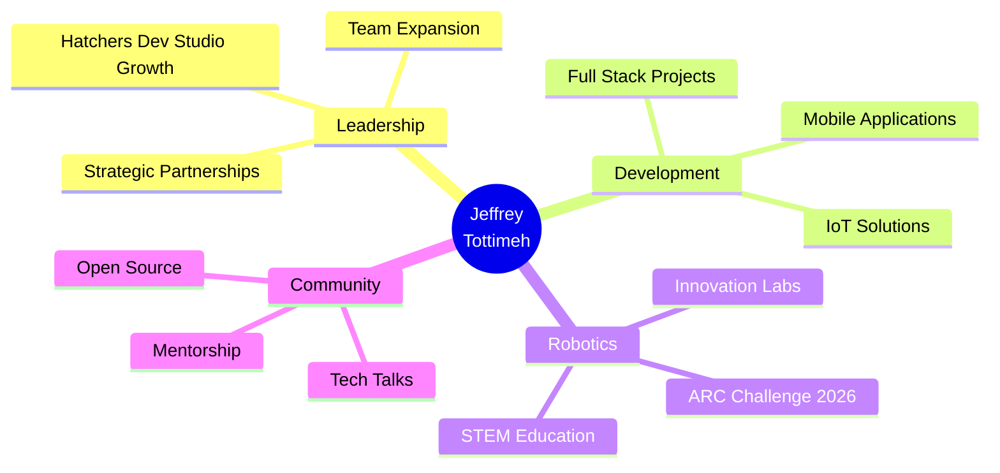

<!-- Profile README for Jeffrey Tottimeh - CEO & Founder -->

<div align="center">
  
</div>

<h3 align="center">
  
</h3>

---

## 🏢 Leadership & Ventures

<table align="center">
<tr>
<td align="center" width="50%">

### **🚀 Hatchers Dev Studio**
**Founder & CEO**

*Building cutting-edge software solutions and digital experiences*

- 💼 Full Stack Development
- 📱 Mobile & Web Applications  
- 🎨 UI/UX Design Solutions
- ☁️ Cloud & DevOps Services

</td>
<td align="center" width="50%">

### **🤖 ARC Robotics Challenge**
**Founder & Organizer**

*Inspiring the next generation of robotics engineers*

- 🏆 Robotics Competitions
- 📚 STEM Education Initiatives
- 🔧 IoT & Embedded Systems
- 🌍 Community Building

</td>
</tr>
</table>

---

## 💼 About Me

```typescript
const jeffreyTottimeh = {
    title: "CEO & Founder",
    companies: ["Hatchers Dev Studio", "ARC Robotics Challenge"],
    location: "Ghana 🇬🇭",
    focus: ["Software Development", "Robotics", "Entrepreneurship"],
    
    expertise: {
        leadership: ["Strategic Planning", "Team Building", "Innovation"],
        development: ["Full Stack", "Mobile Apps", "IoT Solutions"],
        robotics: ["Arduino", "Embedded Systems", "Automation"],
        design: ["UI/UX", "3D Modeling", "Product Design"]
    },
    
    currentProjects: [
        "Scaling Hatchers Dev Studio",
        "Organizing ARC Robotics 2026",
        "Building innovative web solutions"
    ],
    
    lifePhilosophy: "Code with purpose, lead with passion, innovate relentlessly"
};
```

---

## 🛠️ Tech Stack & Expertise

### **Languages**
<p align="center">
  
</p>

### **Frontend Development**
<p align="center">
  
</p>

### **Backend & Databases**
<p align="center">
  
</p>

### **Mobile Development**
<p align="center">
  
</p>

### **Robotics & IoT**
<p align="center">
  
</p>

### **Tools & Platforms**
<p align="center">
  
</p>

---

## 📊 GitHub Analytics

<div align="center">
  
  
</div>

<div align="center">
  
  
</div>

<p align="center">
  
</p>

---

## 🌟 Featured Projects & Achievements

<div align="center">

| 🚀 Project | 📝 Description | 🔗 Link |
|-----------|---------------|---------|
| **Hatchers Dev Studio Website** | Official company portfolio showcasing our services | _In Development_ |
| **ARC Robotics Platform** | Competition management & learning platform | _Coming Soon_ |
| **IoT Automation Suite** | Smart home and industrial automation solutions | _In Progress_ |
| **Mobile Banking App** | Secure fintech solution for microfinance | _Private Repo_ |

</div>

### 🏆 Key Achievements

- 🎯 Founded **Hatchers Dev Studio** - Delivering innovative tech solutions
- 🤖 Launched **ARC Robotics Challenge** - Empowering young engineers
- 💻 Built **15+ production applications** for clients worldwide
- 🌍 Mentored **50+ developers** in full-stack development
- 🏅 Led **robotics workshops** across educational institutions

---

## 📈 Current Focus

<div align="center">



</div>

---

## 🌐 Connect With Me

<div align="center">
  
[](https://twitter.com/tottimehjeffrey)
[](https://gh.linkedin.com/in/jeffrey-tottimeh-135693319)
[](https://www.youtube.com/channel/UCZIBw2LZdsXzqNeds22z_Fg?sub_confirmation=1)
[](https://www.instagram.com/junior_billyhills)
[](https://www.tiktok.com/@lil_jay)

### 💼 Business Inquiries
**Email:** contact@hatchersdev.studio *(update with real email)*  
**Website:** www.hatchersdev.studio *(update with real website)*

</div>

---

## 💡 Philosophy & Vision

> *"Technology is not just about writing code—it's about solving real problems, empowering communities, and building the future we want to see."*

<div align="center">

### 🎯 My Mission
**Leverage technology to create innovative solutions that transform businesses and inspire the next generation of developers and engineers.**

</div>

---

## ☕ Support My Work

<div align="center">

If you appreciate my open-source contributions or want to support Hatchers Dev Studio's initiatives:

<a href="https://www.buymeacoffee.com/hatchercollege" target="_blank">
  
</a>
&nbsp;&nbsp;
<a href="https://www.ko-fi.com/hatchercollege" target="_blank">
  
</a>

</div>

---

## 📫 Let's Collaborate!

I'm always open to:
- 🤝 Partnership opportunities
- 💼 Consulting projects
- 🎓 Speaking engagements
- 🤖 Robotics collaborations
- 💡 Innovative project ideas

**Let's build something amazing together!**

---

<div align="center">
  
  
  
  
  **⭐ From [TA-wiah](https://github.com/TA-wiah) | CEO @ Hatchers Dev Studio**
</div>
